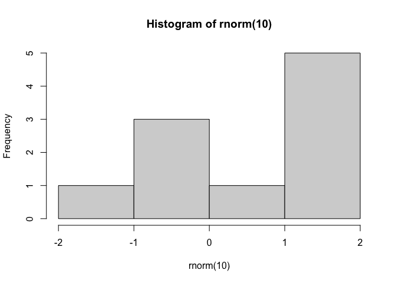

homework1
================
Saloni Bhogale
2022-09-22

``` r
rnorm(10)
```

    ##  [1] -0.7193186 -0.4294246  0.4026299  0.3308678 -0.6768226  0.8490057
    ##  [7]  0.5475543  0.2674042  0.5389846  1.4322371

``` r
hist(rnorm(10))
```

<!-- -->
