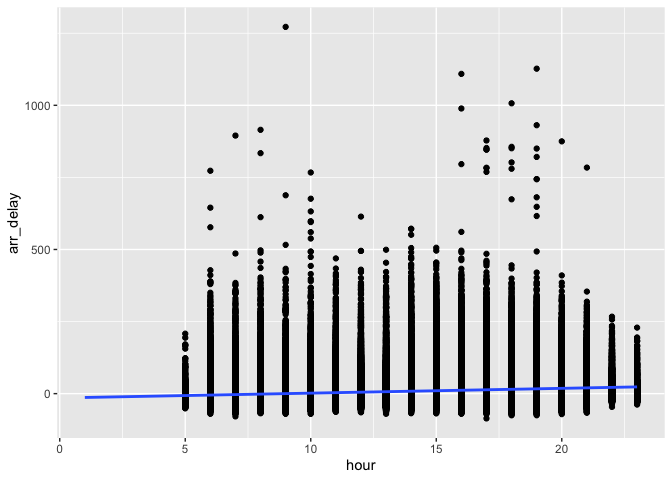

Homework 1 (STAT 433)
================
Saloni Bhogale
2022-09-22

``` r
knitr::opts_chunk$set(echo = TRUE)
library(dplyr)
```

    ## 
    ## Attaching package: 'dplyr'

    ## The following objects are masked from 'package:stats':
    ## 
    ##     filter, lag

    ## The following objects are masked from 'package:base':
    ## 
    ##     intersect, setdiff, setequal, union

``` r
library(nycflights13)
library(ggplot2)
library(knitr)
```

``` r
# Q1: 
# (i) How many flights have a missing dep_time? 
print(paste(nrow(filter(flights, is.na(dep_time))),"flights have a missing dep_time"))
```

    ## [1] "8255 flights have a missing dep_time"

``` r
# (ii) What other variables are missing 
all_variables <- colnames(flights)
# make a new data frame with the names and counts of missing variables 
missing_variables <- c(rep(0, length(all_variables)))

for(i in 1:length(all_variables)){
  missing_variables[i] <- nrow(filter(flights, is.na(get(all_variables[i]))))
}
df_missing <- data.frame("variable_names"=all_variables, "count_missing"=missing_variables)
kable(df_missing)
```

| variable_names | count_missing |
|:---------------|--------------:|
| year           |             0 |
| month          |             0 |
| day            |             0 |
| dep_time       |          8255 |
| sched_dep_time |             0 |
| dep_delay      |          8255 |
| arr_time       |          8713 |
| sched_arr_time |             0 |
| arr_delay      |          9430 |
| carrier        |             0 |
| flight         |             0 |
| tailnum        |          2512 |
| origin         |             0 |
| dest           |             0 |
| air_time       |          9430 |
| distance       |             0 |
| hour           |             0 |
| minute         |             0 |
| time_hour      |             0 |

``` r
# View(filter(flights, is.na(dep_delay)))
```

These rows might be the flights that never took off - perhaps these
flights were cancelled so we do not see values for departure time,
departure delay, arrival time, arrival delay and airtime. However there
are fewer NAs for departure than for arrival (8255 for departure and
9430 for arrival) and this might indicate that at the instant when this
data was captured, there were some flights that were still in air.

``` r
## Q2 

# Currently dep_time and sched_dep_time are convenient to look at, but hard to compute with because they’re not really continuous # # numbers. Convert them to a more convenient representation of number of minutes since midnight.

# here we need to transform the variable dep_time and sched_dep_time 
# let us split the string for dep_time into two columns 
library(stringr)
library(data.table)
```

    ## 
    ## Attaching package: 'data.table'

    ## The following objects are masked from 'package:dplyr':
    ## 
    ##     between, first, last

``` r
flights<- data.table(flights)

flights$dep_minutes <- str_sub(flights$dep_time,-2,-1)
flights$dep_hour <- str_sub(flights$dep_time,1,2)
flights[dep_hour>10,]$dep_hour <- str_sub(flights[dep_hour>10,]$dep_time,1,1)

flights$sched_dep_time_minutes <- str_sub(flights$sched_dep_time,-2,-1)
flights$sched_dep_hour <- str_sub(flights$sched_dep_time,1,2)
flights[sched_dep_hour>10,]$sched_dep_hour <- str_sub(flights[sched_dep_hour>10,]$sched_dep_time,1,1)

flights$dep_minutes_since_midnight <- (as.integer(flights$dep_hour) * 60) + as.integer(flights$dep_minutes)
flights$sched_dep_minutes_since_midnight <- (as.integer(flights$sched_dep_hour) * 60) + as.integer(flights$sched_dep_time_minutes)

kable(flights[,.(dep_time, dep_hour, dep_minutes, dep_minutes_since_midnight),][1:10])
```

| dep_time | dep_hour | dep_minutes | dep_minutes_since_midnight |
|---------:|:---------|:------------|---------------------------:|
|      517 | 5        | 17          |                        317 |
|      533 | 5        | 33          |                        333 |
|      542 | 5        | 42          |                        342 |
|      544 | 5        | 44          |                        344 |
|      554 | 5        | 54          |                        354 |
|      554 | 5        | 54          |                        354 |
|      555 | 5        | 55          |                        355 |
|      557 | 5        | 57          |                        357 |
|      557 | 5        | 57          |                        357 |
|      558 | 5        | 58          |                        358 |

``` r
kable(flights[,.(sched_dep_time, sched_dep_hour, sched_dep_time_minutes, sched_dep_minutes_since_midnight)][1:10])
```

| sched_dep_time | sched_dep_hour | sched_dep_time_minutes | sched_dep_minutes_since_midnight |
|---------------:|:---------------|:-----------------------|---------------------------------:|
|            515 | 5              | 15                     |                              315 |
|            529 | 5              | 29                     |                              329 |
|            540 | 5              | 40                     |                              340 |
|            545 | 5              | 45                     |                              345 |
|            600 | 6              | 00                     |                              360 |
|            558 | 5              | 58                     |                              358 |
|            600 | 6              | 00                     |                              360 |
|            600 | 6              | 00                     |                              360 |
|            600 | 6              | 00                     |                              360 |
|            600 | 6              | 00                     |                              360 |

``` r
# Look at the number of canceled flights per day. Is there a pattern? 
library(lubridate)
```

    ## 
    ## Attaching package: 'lubridate'

    ## The following objects are masked from 'package:data.table':
    ## 
    ##     hour, isoweek, mday, minute, month, quarter, second, wday, week,
    ##     yday, year

    ## The following objects are masked from 'package:base':
    ## 
    ##     date, intersect, setdiff, union

``` r
flights %>% 
  mutate(departure_date = make_datetime(year, month, day)) %>% 
  group_by(departure_date) %>% 
  summarise(cancelled_flights = sum(is.na(dep_delay)),
          total_flights = n(),
          mean_dep_delay = mean(dep_delay, na.rm=TRUE),
          mean_arr_delay = mean(arr_delay, na.rm = TRUE)) %>% 
  ggplot(aes(x=cancelled_flights/total_flights)) +
  geom_point(aes(y=mean_dep_delay), colour='green', alpha=0.2) + 
  geom_point(aes(y=mean_arr_delay), colour='blue', alpha=0.2) + 
  ylab("Mean Delay (Arrival or Departure)")
```

<!-- -->

``` r
# Is the proportion of canceled flights related to the average delay? 


# Use multiple dyplr operations, all on one line, concluding with ggplot(aes(x= ,y=)) + geom_point()
```

It appears that if there are a larger percentage of flights cancelled on
a given day, the arrivals and delays also appear to be high. However, it
seems that on most days, the percentage of cancelled flights is low, so
we would need to check this result in greater detail to be sure!
